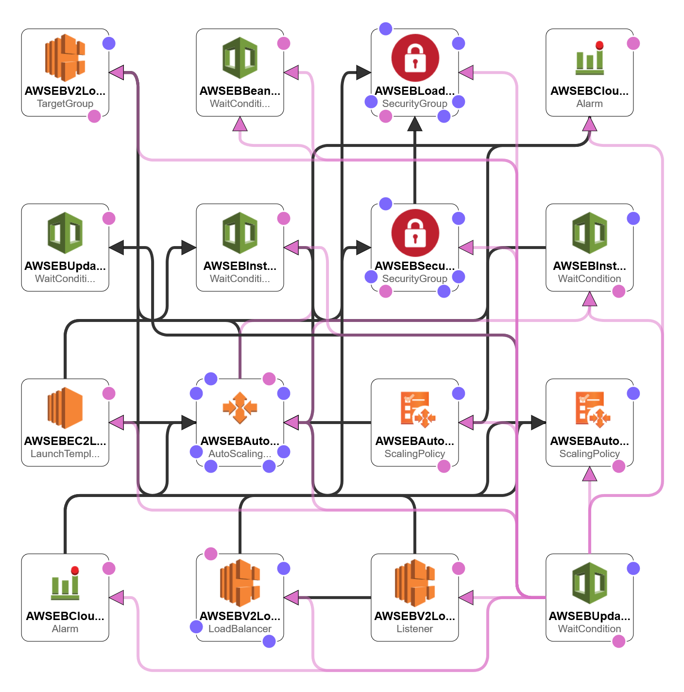
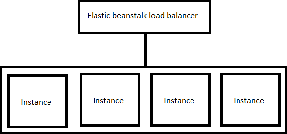

# ProfanityChecker
F-Secure Assignment to create a REST API to check profanities in a sentence.

## General remarks
- Contains 3 separate projects. The instructions for all of them can be found in their own respective folders.
- Service is currently deployed at AWS. The Swagger UI for the service can be viewed [here](http://profanitychecker-env.eba-7yhnkdes.us-east-2.elasticbeanstalk.com)
- Service also has exposed metrics which can be viewed [here](http://profanitychecker-env.eba-7yhnkdes.us-east-2.elasticbeanstalk.com/metrics). This should be viewed with `Prometheus` for better experience.
- While testing on local machine, ensure that service is running and appropriate environment variables are present.
- General improvent ideas are also present in respecive readmes.

## Deployment details
The full template is (obtained from AWS template):
 

The deployment can be summarised as the following. However, in this case, there is only single instance available.
